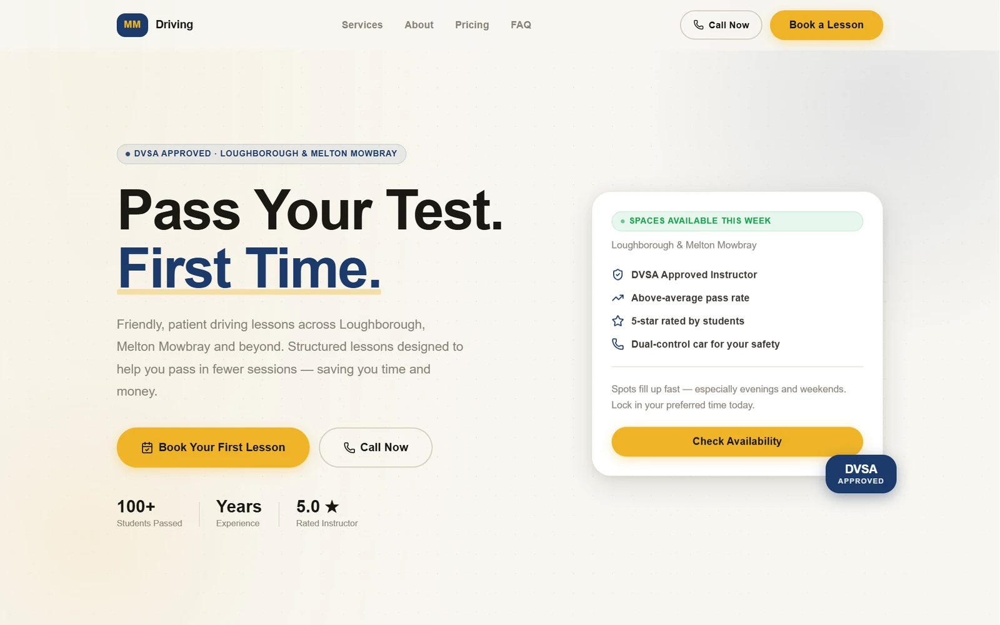
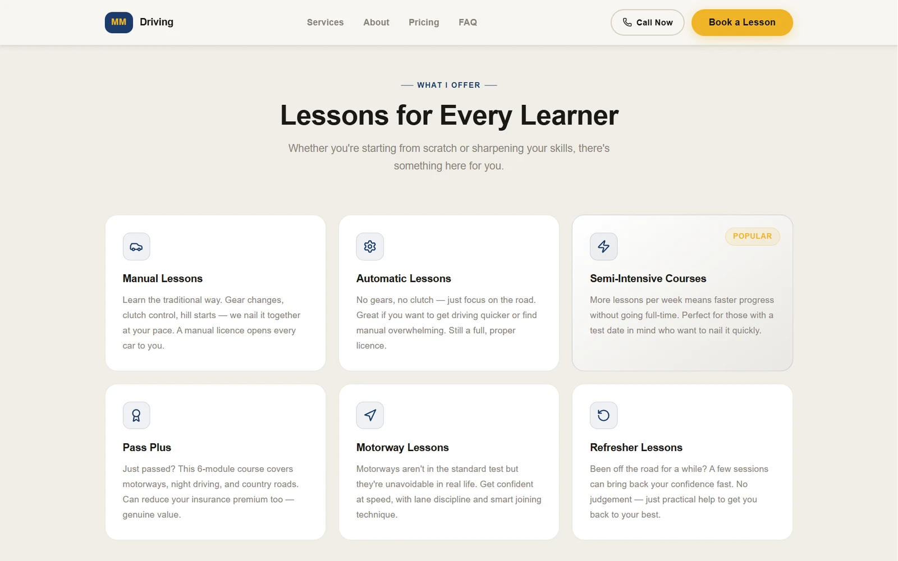
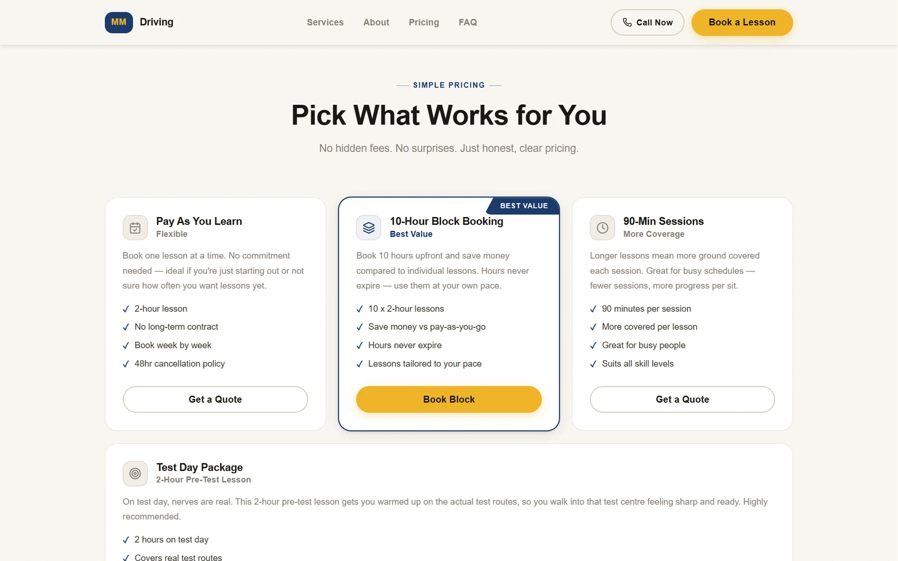
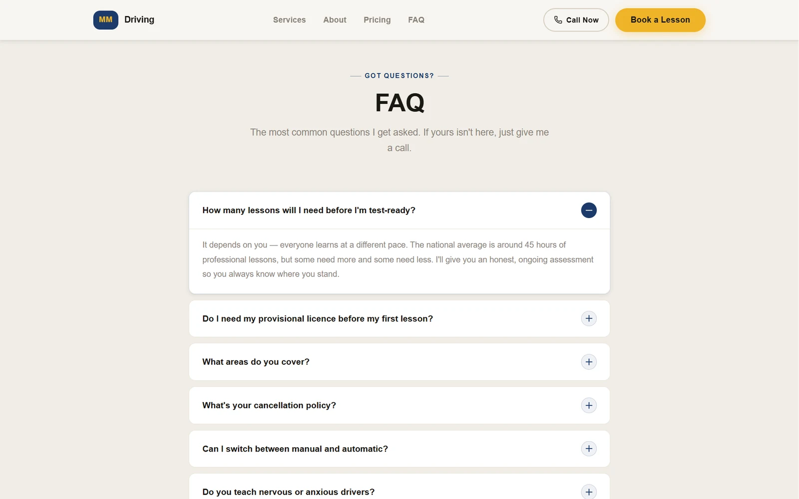

# MMDriving

**[Visit the site](https://mmdriving-snowy.vercel.app)**

A website for an independent, DVSA-approved driving instructor covering Loughborough, Melton Mowbray, Nottingham, Leicester, Derby and Hinckley. It's real client work: I planned the page structure, designed it, wrote the copy and built it, working with the instructor as we went. It's still being finished with the client.




---

## The brief

A nervous learner, or their parent, needs to trust an instructor before they'll book. Most local driving school sites are loud, cluttered and hard to read on a phone. The instructor wanted a site that feels calm and competent, ranks for the towns he covers, and turns a visit into a booked first lesson.

---

## What I built

- **One page, in the order a learner decides.** The page follows the questions people actually ask, in the order they ask them: who's teaching me, what lessons are there, what does it cost, how do I start, and how do I book.
- **Booking is always one tap away.** The header carries "Call Now" and "Book a Lesson" and stays pinned while you scroll. On phones, a bar at the bottom of the screen does the same job.
- **Pricing that points somewhere.** Three ways to pay, with the 10-hour block marked as best value, a separate test-day package, and the cancellation policy stated up front instead of in small print.
- **Answers before they're asked.** An FAQ covers the worries people have before they pick up the phone: how many lessons they'll need, whether they need a provisional licence first, manual or automatic, and whether nervous drivers are welcome.
- **A form that asks for just enough.** Lesson type and area are choices rather than free text, and an optional note has prompts like "I'm quite nervous" to make it easy to say what matters.
- **Every town named.** Each area is spelled out rather than a vague "East Midlands", which helps local search and helps a parent spot their own town.

---

## Design decisions

### Calm and competent over loud
A deep instructional navy with a warm gold for anything you can press. It's a deliberate move away from the bright, saturated colours most local driving school sites use.

### Designing inside a real constraint
There was no budget for a server, so there isn't one. The site is fully static and the enquiry form goes through Formspree. That one decision shaped everything else: no accounts, no personalisation, nothing that assumes infrastructure the client isn't paying for.

### Content in one place
Every piece of text on the site, from prices to FAQ answers, lives in `src/data/siteData.ts`. Updating a price or adding a town means editing one file, not hunting through components.

---

## Stack

| Layer | Technology |
|---|---|
| Framework | React 19 with Vite |
| Language | TypeScript |
| Styling | CSS Modules with design tokens as CSS custom properties |
| Fonts | Clash Display and Cabinet Grotesk from Fontshare |
| Forms | Formspree |
| Hosting | Vercel |

---

## Running it locally

```bash
git clone https://github.com/Cole-Crawley/mmdriving.git
cd mmdriving
npm install
npm run dev
```

Open [http://localhost:5173](http://localhost:5173).

---

## Project structure

```
src/
  data/siteData.ts    All site content: services, prices and FAQs (reviews are held back until real ones arrive)
  types/              Types for that content
  sections/           One component per page section, in page order
  components/         Navbar, footer and the floating call-to-action bar
  hooks/useReveal.ts  Reveals sections as they scroll into view
```

---

## Screenshots

Every lesson type explained in a sentence:



Pricing with one clear recommendation and no hidden terms:



The FAQ answers a nervous learner's worries before they have to call:



*Designed and built by [Cole Crawley](https://colecrawley.vercel.app).*
